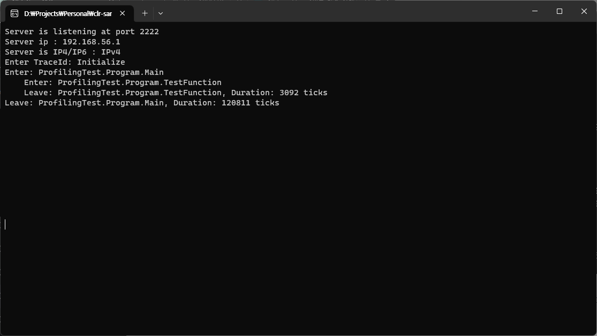
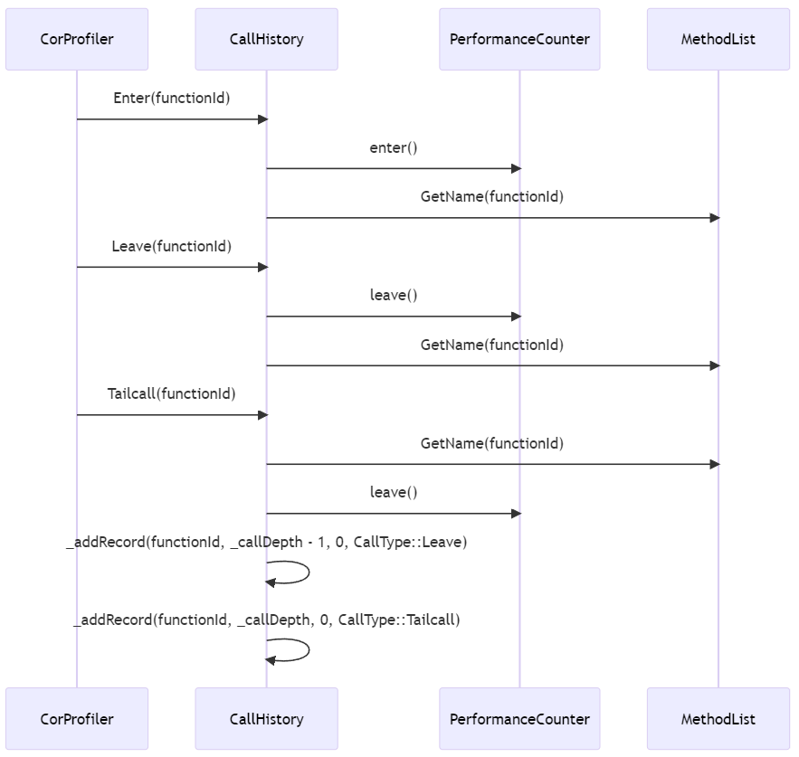
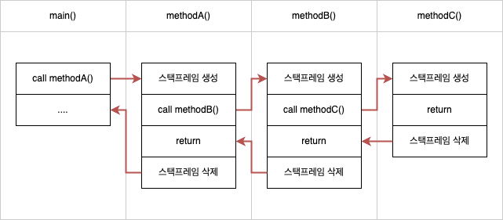
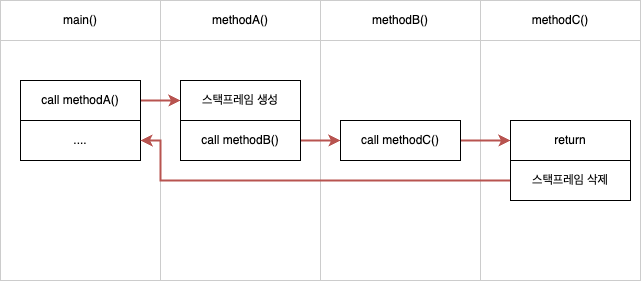

# XPlat CoreCLR Profiler with ELT

This sample shows a minimal CoreCLR profiler that setups the Enter/Leave hooks using `SetEnterLeaveFunctionHooks3WithInfo`


## Prerequisites

* CoreCLR Repository (build from source) Dependencies
* Clang 3.5  (Linux)
* Visual Studio 2022 (Windows)


## Building on Windows

### Environment

All instructions must be run on the ``VS 2022 x64 Native Tools Command Prompt``.

``` batch
SET CORECLR_PATH=../coreclr # default
SET BuildOS=Windows # Windows(default)
SET BuildArch=x64 # x64 (default)
SET BuildType=Debug # Debug(default), Release
SET Output=ClrProfiler.dll # default
```

### Build
On the ``VS 2022 x64 Native Tools Command Prompt``.

* msbuild
* or open using Visual Studio 2017 Community and Build

### 테스트

ELTProfiler, ConsoleTest 프로젝트를 빌드 후 Bin 폴더에 있는 run.bat 파일을 실행하면 기본적인 테스트가 가능합니다.

``` batch
@echo off

SET CORECLR_PROFILER={cf0d821e-299b-5307-a3d8-b283c03916dd}
SET CORECLR_ENABLE_PROFILING=1
SET CORECLR_PROFILER_PATH=%~dp0ClrProfiler.dll

SET PROFILE_BASETIME=1000
SET NAMESPACE_PREFIX=ProfilingTest

ConsoleTest.exe
```


## UDP monitoring

콘솔로 확인할 수 없거나 원격지에서 로그를 확인하고 싶을 때에는 udp-monitor 프로젝트를 빌드하고 실행합니다.
이후에 run.bat 파일을 실행하시면 모든 메시지가 아래의 이미지와 같이 UDP를 통해서 전달됩니다.




## 코드 설명

Profiler API를 이용해서 빌드한 DLL을 환경 변수에 등록하고 난 뒤 닷넷 어플리케이션을 실행하면, CLR은 해당 DLL에 정의 된 Profiler 객체를 생성합니다.
그리고 어플리케이션에서 발생하는 특정 이벤트를 Profiler 객체에게 전달해줍니다.
이 이벤트를 통해서 닷넷 어플리케이션의 내부 활동 및 성능 관련 지표를 얻을 수 있는 것입니다.

아래의 시퀀스 다이어그램은 ELTProfiler 프로젝트의 주요 흐름을 도식화 한 것입니다.



* **Enter**: 새로운 함수가 시작되면 발생하는 이벤트입니다.
  * CallHistory 객체에게 새로운 함수가 실행된 것을 알려줍니다. CallHistory는 스택을 이용해서 함수 호출 깊이를 계산하여 트리 모양으로 함수 호출 이력을 출력할 수 있도록 합니다.
  * PerformanceCounter 객체는 함수가 진입하고 종료되는 시간을 측정하여 함수가 실행되는데 걸리는 시간을 측정합니다.
  * MethodList 객체는 functionId를 통해서 함수 이름을 가져옵니다. 한 번 가져온 함수 이름은 해시맵에 저장해 두었다가 사용하면서 성능을 최대한 끌어 올립니다.
* **Leave**: 함수가 종료되는 시점에 발생하는 이벤트입니다.
* **TailCall**: Tailcall 상황에서 발생하는 이벤트입니다.
  * 테일콜은 함수의 종료 부분에서 다른 함수를 호출할 때 발생하는 최적화된 호출 방식입니다. 이는 함수가 반환될 때 추가로 처리할 코드가 없고, 단순히 다른 함수의 결과값을 그대로 반환하는 경우에 발생합니다. 테일콜이 발생할 때, 현재 함수의 스택 프레임을 유지한 채로 다른 함수를 호출합니다. 그래서 해당 함수가 종료된 후에는 원래 함수로 돌아오지 않고, 원래 함수의 호출자로 직접 반환됩니다. 이러한 동작 때문에 callDepth는 현재 값을 유지합니다. 다시 말해, 테일콜은 callDepth에 추가적인 영향을 주지 않습니다.


## 사용된 라이브러리

### `Settings` Class

#### 용도:
`Settings` 클래스는 애플리케이션 설정 값을 로드하고 관리합니다. 환경 변수를 통해 외부에서 설정을 제공하게 됩니다.

#### 퍼블릭 멤버:

- `getInstance()`: 싱글톤 인스턴스를 반환합니다.
- `getProfileBaseTime()`: `PROFILE_BASETIME` 환경 변수의 값을 반환합니다.
- `getNamespacePrefix()`: `NAMESPACE_PREFIX` 환경 변수의 값을 반환합니다.

### `CallHistory` Class

#### 용도:
`CallHistory` 클래스는 함수 호출의 이력을 관리하며, 각 함수 호출의 시작과 종료, 그리고 해당 호출의 지속 시간을 기록합니다. 이 클래스를 사용하면 프로파일링 데이터를 기반으로 함수 호출 트리를 시각화할 수 있습니다.

#### 퍼블릭 멤버:

- `getInstance()`: 싱글톤 인스턴스를 반환합니다.
- `Enter(FunctionID functionId)`: 함수 호출의 시작을 기록합니다.
- `Leave(FunctionID functionId)`: 함수 호출의 종료를 기록하고 지속 시간을 계산합니다.
- `Tailcall(FunctionID functionId)`: 테일콜이 발생했음을 기록합니다.

### `PerformanceCounter` Class

#### 용도:
`PerformanceCounter` 클래스는 성능 측정을 위한 프로파일링 도구로, 특정 코드의 실행 시간을 측정합니다.

#### 퍼블릭 멤버:

- `getIncetance()`: 싱글톤 인스턴스를 반환합니다.
- `enter()`: 성능 측정을 시작하기 위한 타임스탬프를 저장합니다.
- `leave()`: 성능 측정을 종료하고 시작 이후의 시간(틱 단위)을 반환합니다.
- `leaveInMilliseconds()`: 성능 측정을 종료하고 시작 이후의 시간(밀리초 단위)을 반환합니다.

### `MethodList` Class

#### 용도:
`MethodList` 클래스는 .NET 함수의 식별자(`FunctionID`)를 해당 함수의 전체 이름으로 매핑하는 역할을 합니다.

#### 퍼블릭 멤버:

- `getIncetance()`: 싱글톤 인스턴스를 반환합니다.
- `GetName(FunctionID functionId)`: 주어진 `FunctionID`에 해당하는 함수의 이름을 반환합니다.

### `UdpSocket` Class

#### 용도:
`UdpSocket` 클래스는 UDP 소켓을 통해 텍스트 데이터를 전송하는 기능을 제공합니다. 프로파일링 데이터나 로그 메시지를 원격 시스템으로 전송하는 데 사용될 수 있습니다.

#### 퍼블릭 멤버:

- `getInstance()`: 싱글톤 인스턴스를 반환합니다.
- `sendText(const wstring& message)`: 주어진 메시지를 UDP 소켓을 통해 전송합니다.


## 기타

### naked 함수에 대한 이해

`SetEnterLeaveFunctionHooks3WithInfo()`로 지정되는 함수들은 `naked`로 선언되어야 합니다.

`naked`로 선언된 함수는 컴파일러가 생성하는 스택 프레임 코드(prolog 및 epilog)가 포함되지 않는 상태로 컴파일됩니다. 일반적으로 함수가 호출될 때 스택 프레임을 설정하여 지역 변수 및 매개변수 등에 대한 공간을 확보하고, 함수 종료 시에 이를 해제하는데, `naked` 함수에서는 이러한 동작이 자동으로 이루어지지 않습니다.

따라서, `naked` 함수를 사용할 때는 함수 내부에서 스택 프레임의 관리나 레지스터의 관리 등을 직접 해야 합니다. 이를 통해 스택 프레임이나 레지스터 상태를 세밀하게 제어할 수 있습니다.

아래 제시된 코드 예제에서는 `EnterStub` 함수가 실행되기 전후로 범용 레지스터의 상태를 보존하고 복원하는 작업이 수행되고 있습니다. 이러한 작업은 `pushad`와 `popad` 명령어를 사용하여 수행됩니다.

이와 같은 접근법은 .NET Profiler를 작성할 때 중요하게 작용합니다. Profiler는 코드의 실행을 방해하지 않으면서 코드의 실행 정보를 수집해야 하기 때문에, 레지스터의 상태나 스택 프레임의 상태를 변경하지 않는 것이 중요합니다. 이를 위해 `naked` 함수와 어셈블리 명령어를 사용하여 레지스터와 스택의 상태를 정확하게 제어합니다.

``` cpp
void __declspec(naked) EnterNaked(FunctionIDOrClientID functionIDOrClientID, COR_PRF_ELT_INFO eltInfo)
{
    __asm
    {
        PUSH EAX
        PUSH ECX
        PUSH EDX
        PUSH [ESP + 16]
        CALL EnterStub
        POP EDX
        POP ECX
        POP EAX
        RET 8
    }
}
```

### 테일콜 (Tail Call)

테일콜은 함수 호출의 특별한 형태입니다. 함수의 끝에서 다른 함수를 호출할 때 컴파일러나 런타임 시스템은 현재 함수의 스택 프레임을 새로 호출된 함수의 스택 프레임으로 재활용할 수 있습니다. 이 최적화는 주로 재귀 호출에서 유용하게 작동하여 스택 오버플로우를 방지합니다.

#### 왜 테일콜이 필요한가?

재귀 함수는 자신을 계속해서 호출하므로 스택에 계속해서 프레임이 쌓입니다. 따라서 깊은 재귀 호출을 수행할 경우 스택 오버플로우의 위험이 있습니다. 테일콜 최적화를 사용하면 이러한 문제를 피할 수 있습니다.

#### 테일콜의 조건

모든 함수 호출이 테일콜로 최적화될 수 있는 것은 아닙니다. 테일콜로 처리될 수 있는 함수 호출은 다음 조건을 충족해야 합니다.
* 호출된 함수의 반환 값이 바로 반환되거나 아무런 연산도 없이 그대로 반환되어야 합니다.
* 호출 후에 현재 함수에서 추가로 수행할 작업이 없어야 합니다.

``` cpp
int factorial(int n) {
    if (n <= 1) return 1;
    return n * factorial(n-1);
}
```

위의 factorial 함수는 테일콜로 최적화될 수 없습니다. 왜냐하면 factorial(n-1)의 결과를 n과 곱한 후 반환하기 때문입니다.

그러나 아래와 같이 코드를 수정하면 테일콜로 최적화될 수 있습니다.

``` cpp
int factorial_helper(int n, int acc) {
    if (n <= 1) return acc;
    return factorial_helper(n-1, n*acc);
}

int factorial(int n) {
    return factorial_helper(n, 1);
}
```

#### 테일콜이 아닌 경우


* main에서 A 함수를 호출합니다.
* A 함수의 스택 프레임이 스택의 맨 위에 추가됩니다.
* A에서 B 함수를 호출합니다.
* B 함수의 스택 프레임이 스택의 맨 위에 추가됩니다.
* B에서 C 함수를 호출합니다.
* C 함수의 스택 프레임이 스택의 맨 위에 추가됩니다.
* C 함수가 종료되면 C의 스택 프레임이 스택에서 제거됩니다.
* 제어는 B 함수로 돌아갑니다.
* B 함수가 종료되면 B의 스택 프레임이 스택에서 제거됩니다.
* 제어는 A 함수로 돌아갑니다.
* A 함수가 종료되면 A의 스택 프레임이 스택에서 제거됩니다.
* 제어는 main 함수로 돌아갑니다.
* main 함수의 나머지 부분이 실행됩니다.

#### 테일콜인 경우

* main에서 A 함수를 호출합니다.
* A 함수의 스택 프레임이 스택의 맨 위에 추가됩니다.
* A에서 추가 작업 없이 바로 B 함수를 호출합니다. 이때, A의 스택 프레임은 재사용되어 B의 스택 프레임으로 대체됩니다.
* B에서 추가 작업 없이 바로 C 함수를 호출합니다. 마찬가지로, B의 스택 프레임은 재사용되어 C의 스택 프레임으로 대체됩니다.
* C 함수가 종료되고, 제어는 바로 main 함수로 돌아갑니다. 여기서 주목할 점은 A와 B 함수로의 별도의 반환 없이 바로 main으로 돌아간다는 점입니다.
* main 함수의 나머지 부분이 실행됩니다.
